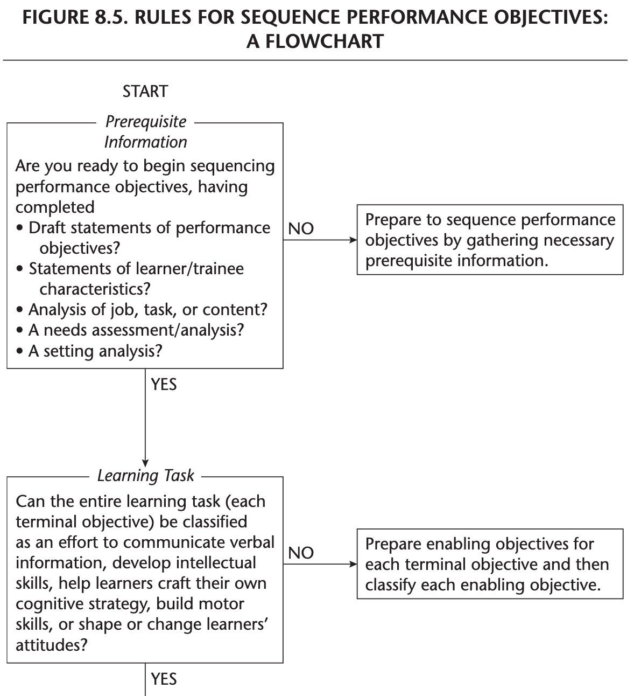

```{r setup, include=FALSE}
usethis::use_git_ignore(c("*.csv", "*.rds"))
options(htmltools.dir.version = FALSE)

library(knitr)
library(tidyverse)
library(xaringan)
library(fontawesome)
```

class: inverse, center, middle

# `r fa("fas fa-images", fill = "#fff")`

**View the slides:** 

[bretsw.com/eme5601-fs24-module6](https://bretsw.com/eme5601-fs24-module6)

---

class: inverse, center, middle

# `r fa("fas fa-utensils", fill = "#fff")` <br><br> Module 5 <br> Recap

---

# `r fa("fas fa-utensils", fill = "#fff")` Work Analysis

Work analysis is the **an important step** in the iterative design cycle:

```{r, out.width = "480px", echo = FALSE, fig.align = "center"}
include_graphics("img/Rothwell-fig2-1.png")
```

<div class="caption">
Figure 2.1 from Rothwell et al. (2016, p. 20)
<br><br>
</div>

---

# `r fa("fas fa-utensils", fill = "#fff")` Job-Task Analysis

```{r, out.width = "100%", echo = FALSE, fig.align = "center"}

```

<div class="caption">
Figure 1 from Hahn et al. (1995, p. 24)
<br><br>
</div>

---

# `r fa("fas fa-utensils", fill = "#fff")` Why Work Analysis?

```{r, out.width = "100%", echo = FALSE, fig.align = "center"}

```

<div class="caption">
Figure 7.2 from Rothwell & Kazanas (2008, p. 152)
<br><br>
</div>


---

class: inverse, center, middle

#  `r fa("fas fa-mug-hot", fill = "#fff")` <br><br> Module 6 <br> Design & Development

---

# `r fa("fas fa-mug-hot", fill = "#fff")` Design & Development

```{r, out.width = "720px", echo = FALSE, fig.align = "center"}

```

### Think of something you've built that you were proud of...

---

# `r fa("fas fa-mug-hot", fill = "#fff")` Design & Development

```{r, out.width = "720px", echo = FALSE, fig.align = "center"}

```

### Why does design matter?

--

`r fa("far fa-comments", fill = "#782F40")` Discuss in groups...

---

# `r fa("fas fa-mug-hot", fill = "#fff")` Design & Development

```{r, out.width = "720px", echo = FALSE, fig.align = "center"}

```

### How do you decide if a design is good or bad?

---

# `r fa("fas fa-mug-hot", fill = "#fff")` Design & Development

```{r, out.width = "420px", echo = FALSE, fig.align = "center"}
include_graphics("img/design-book.jpg")
```

### Exercise:

--

`r fa("fas fa-person-walking", fill = "#782F40")` Notice design (good and bad) all around you.


---

class: inverse, center, middle

# `r fa("fas fa-mug-hot", fill = "#fff")` <br><br> Organizing Instructional Programs and/or Products <br> (Ch. 8)

---

# `r fa("fas fa-mug-hot", fill = "#fff")` Clarifying Terms

--

- **Scope:** length and depth (feasibility)

--

  - Learner needs, client preferences, budget

--

- **Goals:** warm fuzzies (not measurable)

--

  - Instructional goals and Organizational goals
  
--

- **Objectives:** measurable outcomes

--

  - *Learning objectives:* what learners should know after instruction

--

  - *Performance objectives:* what learners should be able to do after instruction

--

- **Learner Activities:** what learners do during a planned learning experience

--

  - Can be designed for *knowledge*, *feelings*, *skills*, or some mix of these.

--

- **Goal Analysis:** turning warm fuzzies into specific and measurable targets

---

# `r fa("fas fa-mug-hot", fill = "#fff")` Task Analysis to Objectives

```{r, out.width = "520px", echo = FALSE, fig.align = "center"}

```

<div class="caption">
Figure 8.1 from Rothwell et al. (2016, p. 130)
<br><br>
</div>

---

# `r fa("fas fa-mug-hot", fill = "#fff")` Clarifying Terms

--

- **Learning Task Analysis:** identify prerequisite knowledge

--

- **Hierarchical Analysis:** flowchart the relationship between work task and required prerequisite knowledge

--

- **Cluster Analysis:** categorize information related to a goal

--

- **Procedural Analysis:** flowchart steps in a procedure

--

<hr>

### `r fa("far fa-comments", fill = "#782F40")` Discuss in groups:

Begin to design instruction you could have used for your first job...

---

# `r fa("fas fa-mug-hot", fill = "#fff")` Cognitive Domain

```{r, out.width = "560px", echo = FALSE, fig.align = "center"}

```

<div class="caption">
Figure 8.2 from Rothwell et al. (2016, p. 134)
<br><br>
</div>

---

# `r fa("fas fa-mug-hot", fill = "#fff")` Affective Domain

```{r, out.width = "560px", echo = FALSE, fig.align = "center"}

```

<div class="caption">
Figure 8.3 from Rothwell et al. (2016, p. 135)
<br><br>
</div>

---

# `r fa("fas fa-mug-hot", fill = "#fff")` Psychomotor Domain

```{r, out.width = "560px", echo = FALSE, fig.align = "center"}

```

<div class="caption">
Figure 8.4 from Rothwell et al. (2016, p. 136)
<br><br>
</div>

---

# `r fa("fas fa-mug-hot", fill = "#fff")`  Writing Objectives

--

- "On completion of instruction, learners should be able to..."

--

- Focus on **performance**: how a learner will demonstrate proficiency

--

- Name **criteria**: how well a learner must perform to demonstrate competence (process or product)

--

- Name **conditions**: what must exist when the learner demonstrates their knowledge, skill, or ability

--

- Think about **sequence**: appropriate order for learning

--

<hr>

### `r fa("far fa-comments", fill = "#782F40")` Discuss in groups:

--

Revise the objectives you wrote for your first job...

---

# `r fa("fas fa-mug-hot", fill = "#fff")` Sequencing

```{r, out.width = "420px", echo = FALSE, fig.align = "center"}

```

<div class="caption">
Figure 8.5 from Rothwell et al. (2016, pp. 139-144)
<br><br>
</div>


---

class: inverse, center, middle

# `r fa("fas fa-mug-hot", fill = "#fff")` <br><br> Designing Instructional Interventions <br> (Ch. 9)

---

# `r fa("fas fa-mug-hot", fill = "#fff")` Designing Instruction

```{r, out.width = "360px", echo = FALSE, fig.align = "center"}

```

### How can the desired results of instruction (i.e., the objectives) be achieved?

--

- **Instructional Strategy:** overall plan governing instructional content

--

  - What to do to achieve results

--
  
  - Plan holistically (systems thinking)

--

  - Consider feasibility
  
--

  - Add technology at the end

---

# `r fa("fas fa-mug-hot", fill = "#fff")` Designing Instruction

```{r, out.width = "360px", echo = FALSE, fig.align = "center"}

```

### How can the desired results of instruction (i.e., the objectives) be achieved?

- **Instructional Tactics:** any instructional activity undertaken to facilitate a strategy

--

- See **Table 9.1** (pp. 146-149) for detailed overview of instructional strategies and tactics

---

# `r fa("fas fa-mug-hot", fill = "#fff")` Designing Instruction

### How to choose the mode of instruction?

```{r, out.width = "560px", echo = FALSE, fig.align = "center"}

```

<div class="caption">
Figure 9.1 from Rothwell et al. (2016, p. 163)
<br><br>
</div>

---

# `r fa("fas fa-mug-hot", fill = "#fff")` Designing Instruction

```{r, out.width = "600px", echo = FALSE, fig.align = "center"}

```

### `r fa("far fa-comments", fill = "#782F40")` Discuss in groups:

What modes and technologies would you include when designing instruction you could have used for your first job?


---

class: inverse, center, middle

# `r fa("fas fa-mug-hot", fill = "#fff")` <br><br> Selecting or Modifying Existing Instructional Materials <br> (Ch. 11)

---

# `r fa("fas fa-mug-hot", fill = "#fff")` Developing Materials

--

### Step 1: Prepare a Working Outline

--

- Who are the learners?

--

- Where are the learners functioning? (i.e., geographical location)

--

- When are the learners functioning? (i.e., is timing an issue?)

--

- How are learners functioning? (i.e., is that important to meet the learning objectives?)

--

- How important is it that some issues are covered?

--

- How well does the outline address all issues covered in the objectives?

--

- How is success in the program evaluated?

---

# `r fa("fas fa-mug-hot", fill = "#fff")` Developing Materials

### Step 2: Conduct Research

--

- **Materials Assessment:** interview knowledgeable people in the organization

--

  - Have you ever seen any procedure manuals, checklists, descriptive booklets, or training manuals on [subject name]?

--

  - Who do you know in this organization who is especially knowledgeable about this subject?

--

  - What department(s) might have needed, in the past, to do special training on the subject?

--

### Step 3: Examine Existing Intructional Materials

--

- **Materials Analysis**

--

### Step 4: Arrange or Modify Existing Materials

---

# `r fa("fas fa-mug-hot", fill = "#fff")` Developing Materials

```{r, out.width = "560px", echo = FALSE, fig.align = "center"}

```

### Final key question: 

--

- **Cost-Benefit Analysis**

--

  - Will the benefits of buying and modifying instruction from an external source outweigh the costs associated with tailoring them to meet the unique needs for a targeted group?


---

class: inverse, center, middle

# `r fa("fas fa-mug-hot", fill = "#fff")` <br><br> Developing Instructional Materials <br> (Ch. 12)

---

# `r fa("fas fa-mug-hot", fill = "#fff")` Developing Materials

### Lesson Plan

```{r, out.width = "480px", echo = FALSE, fig.align = "center"}

```

<div class="caption">
Exhibit 12.1 from Rothwell et al. (2016, p. 203)
<br><br>
</div>

---

# `r fa("fas fa-mug-hot", fill = "#fff")` Developing Materials

### Case Study

```{r, out.width = "480px", echo = FALSE, fig.align = "center"}

```

<div class="caption">
Exhibit 12.2 from Rothwell et al. (2016, p. 209)
<br><br>
</div>

---

# `r fa("fas fa-mug-hot", fill = "#fff")` Developing Materials

### Role Play

```{r, out.width = "420px", echo = FALSE, fig.align = "center"}
include_graphics("img/Rothwell-exhibit12-3.png")
```

<div class="caption">
Exhibit 12.3 from Rothwell et al. (2016, p. 211)
<br><br>
</div>

---

# `r fa("fas fa-mug-hot", fill = "#fff")` Developing Materials

### Critical Incidents

```{r, out.width = "480px", echo = FALSE, fig.align = "center"}

```

<div class="caption">
Exhibit 12.4 from Rothwell et al. (2016, p. 213)
<br><br>
</div>


---

class: inverse, center, middle

# `r fa("fas fa-mug-hot", fill = "#fff")` <br><br> Design Practice

---

# `r fa("fas fa-mug-hot", fill = "#fff")` Design Practice

```{r, out.width = "720px", echo = FALSE, fig.align = "center"}

```

### `r fa("far fa-comments", fill = "#782F40")` Discuss in groups:

--

Continue to design and develop instruction you could have used for your first job...


---

class: inverse, center, middle

# `r fa("fas fa-toolbox", fill = "#fff")` <br><br> Expanding the <br> ISD Analysis Toolbox

---

# `r fa("fas fa-toolbox", fill = "#fff")` ISD Analysis Toolbox

```{r, out.width = "280px", echo = FALSE, fig.align = "center"}
include_graphics("img/toolbench.jpg")
```

- Systems Analysis
- Performance Analysis
- Needs Assessment / Needs Analysis
- Training Requirements Analysis
- Root Cause Analysis
- Competency Assessment
- Learner Assessment
- Setting Analysis
- Developmental Setting Assessment
- Job Analysis
- Task Analysis
- Content (Subject Matter) Analysis

---

# `r fa("fas fa-toolbox", fill = "#fff")` ISD Analysis Toolbox

```{r, out.width = "280px", echo = FALSE, fig.align = "center"}
include_graphics("img/toolbench.jpg")
```

- **Goal Analysis**
- **Learning Task Analysis**
- **Hierarchical Analysis**
- **Cluster Analysis**
- **Procedural Analysis**
- **Materials Assessment / Materials Analysis**
- **Cost-Benefit Analysis**

---

# `r fa("fas fa-toolbox", fill = "#fff")` Design & Development

```{r, out.width = "480px", echo = FALSE, fig.align = "center"}
include_graphics("img/Rothwell-fig2-1.png")
```

<div class="caption">
Figure 2.1 from Rothwell et al. (2016, p. 20)
<br><br>
</div>


---

class: inverse, center, middle

# `r fa("fas fa-binoculars", fill = "#fff")` <br><br> Looking ahead

---

# `r fa("fas fa-calendar-day", fill = "#fff")` Semester Schedule

```{r, out.width = "480px", echo = FALSE, fig.align = "center"}
include_graphics("img/across-time.jpg")
```

- **Module 1:** Introduction to Instructional Systems Design

- **Module 2:** Systems Analysis

- **Module 3:** ISD & HPT

- **Module 4:** Needs Assessment

- **Module 5:** Work Analysis

- **Module 6: Design & Development**

- **Module 7:** Evaluation

---

# `r fa("far fa-keyboard", fill = "#fff")` Major Assignments

```{r, out.width = "320px", echo = FALSE, fig.align = "center"}
include_graphics("img/build.jpg")
```

- **Assignments** (70%)

  - Module 2 Assignment: Systems Analysis paper (150 points)

  - Module 3 Assignment: Annotated Bibliography 1 (50 points)

  - Module 4 Assignment: Needs Assessment paper (150 points)

  - Module 5 Assignment: Annotated Bibliography 2 (50 points)

  - **Module 6 Assignment: Work Analysis paper (150 points)**

  - Module 7 Assignment: ISD Process Model paper (150 points)

---

class: inverse, center, middle

# `r fa("fas fa-question", fill = "#fff")` <br><br> Questions

<hr>

**What questions can I answer for you now?**

**How can I support you this week?**

<hr>

`r fa("fas fa-envelope", fill = "#fff")` [bret.staudtwillet@fsu.edu](mailto:bret.staudtwillet@fsu.edu) | `r fa("fas fa-globe", fill = "#fff")` [bretsw.com](https://bretsw.com) | `r fa("fab fa-github", fill = "#fff")` [GitHub](https://github.com/bretsw/)